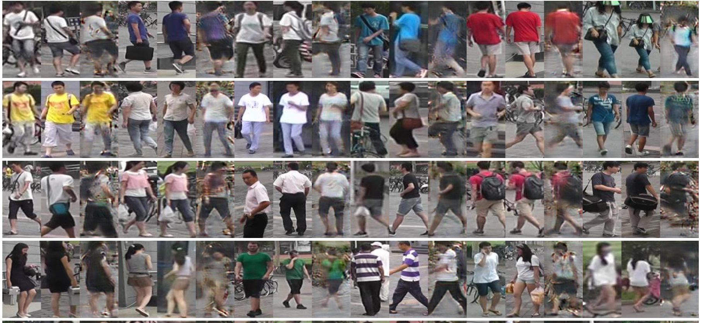

# Human Pose Transfer

## Implemented paper

- [x] [Pose Guided Person Image Generation](http://arxiv.org/abs/1705.09368) (NIPS2017)
- [ ] [Disentangled Person Image Generation](http://arxiv.org/abs/1712.02621) (CVPR2018 Spotlight)
- [ ] [Progressive Pose Attention Transfer for Person Image Generation](https://arxiv.org/abs/1904.03349) (CVPR2019 Oral)
- [x] [Pose-normalized image generation for person re-identification](https://arxiv.org/abs/1712.02225)

## Prepare

### Requirement

* pytorch **1.0+**
* [ignite](https://pytorch.org/ignite/)
* torchvision
* numpy
* scipy
* scikit-image
* pandas
* tqdm

### GPU

`batch_size=16`,  `Memory-Usage`: <5GB
`batch_size=32`,  `Memory-Usage`: <10GB

### DataSet

For fair comparison, all implementation use 263,632 training pairs and 12,000 testing pairs from Market-1501 
as in [PATN](https://arxiv.org/abs/1904.03349)

| description                                                  | download from                                                |
| ------------------------------------------------------------ | ------------------------------------------------------------ |
| Market1501 dataset images                                    | [Market1501](http://www.liangzheng.com.cn/Project/project_reid.html) |
| train/test splits `market-pairs-train.csv`, `market-pairs-test.csv` | [Pose-Transfer](https://github.com/tengteng95/Pose-Transfer#data-preperation) |
| train/test key points annotations `market-annotation-train.csv`, `market-annotation-train.csv` | [Pose-Transfer](https://github.com/tengteng95/Pose-Transfer#data-preperation) |
| Attribute of images **not necessary for now**                | [Market-1501_Attribute](https://github.com/vana77/Market-1501_Attribute) | 

copy&rename above pair and annotation file to `./data`

Finally, your `./data` folder looks like:

```text
data
├── market
│   ├── annotation-test.csv
│   ├── annotation-train.csv
│   ├── pairs-test.csv
│   ├── pairs-train.csv
│   ├── attribute
│   │   ├── evaluate_market_attribute.m
│   │   ├── gallery_market.mat
│   │   ├── market_attribute.mat
│   │   ├── README.md
│   │   └── sample_image.jpg
│   ├── test # WILL BE GENERATED IN NEXT STEP
│   │   ├── pose_map_image
│   │   └── pose_mask_image
│   └── train # WILL BE GENERATED IN NEXT STEP
│       ├── pose_map_image
│       └── pose_mask_image
```

### Generate Pose 18-channels image and corresponding mask

1. `python3 tool/generate_pose_map_add_mask.py --type train`
2. `python3 tool/generate_pose_map_add_mask.py --type test`

## Train

All implementation use the same `train.py`.

1. use `python3 train.py -h` to see supported train process.
2. use `python3 train.py --name <TrainName> -h` to see train option for `TrainName`.
3. use `python3 train.py --name <TrainName>` to train.

You can observe the generated results during the train: `cd output_dir && python3 -m http.server`

*I just create the `index.html` in `output_dir`, so feel free to use anything(like `devd`) to see mid product*

## Test

All implementation use the same `test.py`.

1. use `python3 test.py -h` to see support test process.
2. use `python3 test.py --name <TestName> -h` to see test option for `TestName`.
3. use `python3 test.py --name <TestName>` to test.

## Evaluate

First, please use `test.py --name PG2-Generate` to generate 12000 test images.

For fair comparisons, I just copy&use the same evaluation codes in previous works Deform, PG2 and PATN 
which 

I recommend using docker to evaluate the result 
because evaluation codes use some outdated frameworks, like `Tensorflow 1.4.1`

So, next:

1. build docker image with `./evaluate/Dockerfile`
2. run evaluate script

```bash
$ cd evaluate
$ docker build -t hpt_evaluate . 
$  # For user in China, you can build docker image like this:
$ docker build -t hpt_evaluate . --build-arg PIP_PYPI="https://pypi.tuna.tsinghua.edu.cn/simple"
$ cd ..
$ docker run -v $(pwd):/tmp -e NVIDIA_VISIBLE_DEVICES=0 -w /tmp --runtime=nvidia -it --rm hpt_evaluate:latest python evaluate/getMetrics_market.py
```

Or use image `tensorflow/tensorflow:1.4.1-gpu-py3` to evaluate in docker bash:

```
docker run -v $(pwd):/tmp -w /tmp --runtime=nvidia -it --rm tensorflow/tensorflow:1.4.1-gpu-py3 bash
# now in docker:
$ pip install scikit-image tqdm 
$ python evaluate/getMetrics_market.py
```

## Implement result

### PG2



```bash
# stage 1
python3 train.py --name PG2-1 \
    --gpu_id 0 \
    --epochs 2 \
    --output_dir "./checkpoints/PG2-1" \
    --train_pair_path "./data/market/pairs-train.csv" \
    --test_pair_path "./data/market/pairs-test.csv" \
    --market1501 "/root/data/Market-1501-v15.09.15"
```

```bash
# stage 2
MARKET1501="/root/data/Market-1501-v15.09.15/"
G1PATH="./data/market/models/PG2/G1.pth"
python3 train.py --name PG2-2 \
    --epochs 2 \
    --gpu_id 1 \
    --batch_size 32 \
    --output_dir "checkpoints/PG2-2" \
    --market1501  ${MARKET1501} \
    --G1_path  ${G1PATH} \
    --save_interval 200 \
    --print_freq 200 \
    --gan_loss BCELoss \
    --discriminator DCGAN-improve
```

```bash
# generate images
GENERATED_IMAGE_PATH="./generated"
LIMIT=-1
GPU_ID=1
G1_MODEL_PATH="./data/market/models/PG2/G1.pth"
G2_MODEL_PATH="./checkpoints/patchgan/lr0.00008/models/networks_G2_13400.pth"
MARKET1501="/root/data/Market-1501-v15.09.15/"

python3 test.py --name PG2-Generate
    --market1501 ${MARKET1501}
    --gpu_id ${GPU_ID}
    --G1_path ${G1_MODEL_PATH}
    --G2_path ${G2_MODEL_PATH}
    --output_dir ${GENERATED_IMAGE_PATH}
    --limit ${LIMIT}
```

## Thanks

[Liqian Ma](https://github.com/charliememory) - [PG2's Tensorflow implementation](https://github.com/charliememory/Pose-Guided-Person-Image-Generation)
Thanks for his patience. (￣▽￣)"

[@tengteng95](https://github.com/tengteng95) - [Pose-Transfer](https://github.com/tengteng95/Pose-Transfer) 
for clear code structure and his great paper.